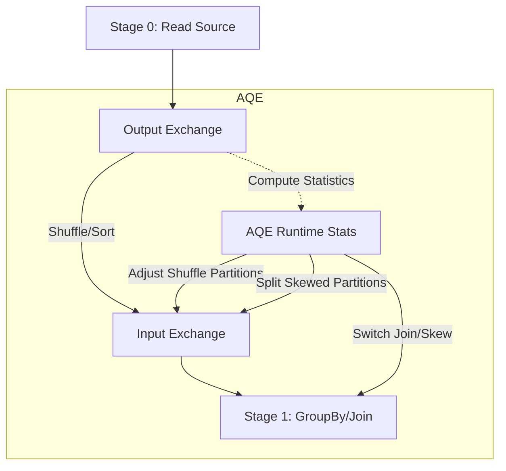

# Spark Fundamentals: Adaptive Query Execution (AQE)

## Key Concepts
- Adaptive Query Execution (AQE) is a Spark 3.0 feature for runtime query plan optimization.
- AQE provides:
  - Dynamic coalescing of shuffle partitions
  - Dynamic switching of join strategies
  - Dynamic optimization of skew joins
- AQE solves problems of inefficient shuffle partitioning, data skew, and suboptimal join selection.

## Architecture Overview
- Spark jobs with wide dependencies (e.g., groupBy, join) trigger shuffle/sort operations.
- Static shuffle partitioning (e.g., `spark.sql.shuffle.partitions`) can lead to empty, disproportionate, or skewed partitions and inefficient resource usage.
- AQE computes statistics during shuffle/sort and replans execution for optimal performance.
- AQE dynamically adjusts shuffle partitions, merges small partitions, splits skewed partitions, and switches join strategies based on runtime statistics.

## Components
- **Shuffle Partition Coalescing**: Merges small partitions, eliminates empty ones, and balances partition sizes for efficient resource use.
  - **How AQE Coalesces Shuffle Partitions**:
    - AQE computes statistics on shuffle data after the initial stage completes.
    - It identifies small or empty partitions that would otherwise result in unnecessary tasks and wasted resources.
    - AQE merges these small partitions together, reducing the total number of shuffle partitions and tasks.
    - This process eliminates empty partitions, so Spark does not launch tasks for partitions with no data.
    - Coalescing partitions leads to more balanced partition sizes, which helps tasks finish in similar time and improves overall parallelism.
    - Fewer, larger partitions reduce scheduling overhead and network I/O, and make better use of executor memory and CPU.
    - The result is faster query execution, less resource waste, and improved cluster efficiency.
- **Dynamic Join Selection**: Switches join algorithms (e.g., broadcast, sort-merge) at runtime based on actual data statistics, especially after filters or transformations.
  - **Broadcast Join vs Sort-Merge Join**:
    - Broadcast join is preferred when one side of the join is small enough to fit in memory (below broadcast threshold).
    - Broadcast join avoids expensive shuffle and sort operations, reducing network I/O and execution time.
    - Sort-merge join is used for large tables, but incurs shuffle and sort overhead, and is slower for selective joins.
    - AQE computes table sizes at runtime and switches to broadcast join if a table becomes small after filtering or transformations, even if the initial plan was sort-merge join.
    - AQE also uses local shuffle reader to further optimize broadcast join and reduce network traffic.
- **Skew Join Optimization**: Detects and splits large skewed partitions, duplicates matching partitions, and balances task resource usage.
  - **How AQE Optimizes Skew Joins**:
    - AQE monitors partition sizes during shuffle and identifies skewed partitions (size > 5x median and > 256MB by default).
    - When a skewed partition is detected, AQE splits it into multiple smaller partitions, allowing parallel processing and avoiding straggler tasks.
    - AQE duplicates the matching partition from the other side of the join, so each split can be joined independently.
    - This results in more balanced resource usage, faster completion, and reduced risk of OOM errors for skewed joins.
    - Without AQE, a single large partition can cause one task to run much longer or fail, while others finish quickly, wasting resources.
- **Configuration Parameters**:
  - `spark.sql.adaptive.enabled`: Master switch for AQE (default: false)
  - `spark.sql.adaptive.coalescePartitions.initialPartitionNum`: Initial max shuffle partitions
  - `spark.sql.adaptive.coalescePartitions.minPartitionNum`: Minimum shuffle partitions after coalescing
  - `spark.sql.adaptive.coalescePartitions.partitionSize`: Advisory partition size (default: 64MB)
  - `spark.sql.adaptive.coalescePartitions.enabled`: Enable/disable partition coalescing (default: true)
  - `spark.sql.adaptive.skewJoin.enabled`: Enable skew join optimization
  - `spark.sql.adaptive.skewJoin.skewedPartitionFactor`: Partition is skewed if >5x median size (default: 5)
  - `spark.sql.adaptive.skewJoin.skewedPartitionThresholdInBytes`: Partition is skewed if >256MB (default: 256MB)

## Flow Chart

## Tables
| Feature                | Description                                                      |
|------------------------|------------------------------------------------------------------|
| Shuffle Coalescing     | Merges small partitions, eliminates empty partitions              |
| Dynamic Join Selection | Switches join algorithms based on runtime stats                  |
| Skew Join Optimization | Splits large skewed partitions for better parallelism            |

## Additional Notes
- AQE is most effective for queries with wide dependencies (e.g., groupBy, join).
- Setting shuffle partitions statically is difficult; AQE automates partition sizing for optimal performance.
- AQE reduces resource waste, improves parallelism, and mitigates data skew.
- Skew join optimization splits large partitions and duplicates matching partitions for balanced resource use.
- All AQE features are controlled by configuration parameters; disabling AQE disables all related optimizations.
