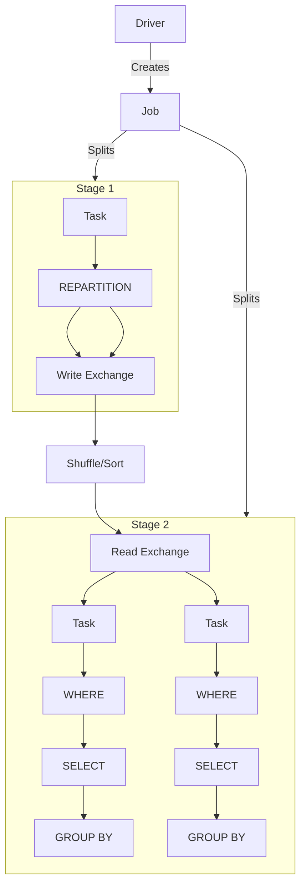

# Spark Fundamentals: Jobs and Stages

## Key Concepts
- Spark APIs are classified into Transformations and Actions.
- Transformations: process/convert data; can be narrow or wide dependency.
  - Narrow: operate independently on partitions (e.g., select, filter).
  - Wide: require grouping/shuffling (e.g., groupBy, join).
- Actions: trigger computation and result collection (e.g., read, write, collect).
- Each action creates a Spark job; a job contains all transformations in its code block.

## Architecture Overview
- The driver creates a logical query plan for each job.
- Logical plans are split into stages at wide dependencies.
- Stages run sequentially; output of one is input for the next.
- Data between stages is exchanged via shuffle/sort (expensive operation).
- Each stage is executed as parallel tasks, one per input partition.

## Components
- **Job**: Created for each action; contains transformations.
- **Stage**: Subdivision of a job; ends at wide dependency.
- **Task**: Smallest unit of work; runs on executor for a partition.
- **Driver**: Assigns tasks to executors, manages job execution.
- **Executor**: Runs JVM process, executes tasks in slots (threads).

## Flow Chart

## Tables
| Term      | Description                                              |
|-----------|----------------------------------------------------------|
| Job       | Created for each action; contains transformations        |
| Stage     | Subdivision of job at wide dependencies                  |
| Task      | Smallest unit of work; runs on executor for a partition  |
| Driver    | Assigns tasks, manages execution                         |
| Executor  | JVM process; runs tasks in slots                         |
| Shuffle   | Data exchange between stages (expensive operation)       |

## Additional Notes
- `count()` is an action in Spark; it triggers execution and returns a result to the driver.
- If the stage before `count()` has 2 input partitions, Spark will launch 2 parallel tasks, each computing a partial count for its partition. The driver aggregates these partial counts for the final result.
- Number of tasks per stage = number of input partitions.
- Executor slots = parallel threads per executor (based on CPU cores).
- Driver schedules tasks to available slots; excess tasks wait for free slots.
- Collect action: tasks send results to driver; driver aggregates results.
- If a task fails, driver retries on another executor; repeated failure marks job as failed.
