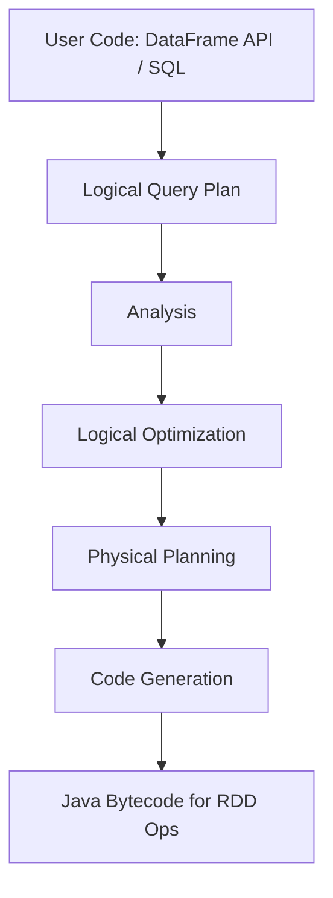

# Spark Fundamentals: Query Planning & SQL Engine

## Key Concepts
- Spark provides two main interfaces for data processing: Spark SQL and DataFrame API.
- DataFrame API uses functional programming; Spark SQL is ANSI SQL:2003 compliant.
- Dataset API is available for Scala/Java, but not PySpark; DataFrame API is recommended for most use cases.
- Spark code is a sequence of jobs; each job represents a logical query plan.

## Query Planning Stages
1. **Analysis**
   - Parses code for errors and resolves column names/data types using the Catalog.
   - Applies implicit type casting if needed.
   - Fails with AnalysisException if unresolved columns, types, or functions are found.
2. **Logical Optimization**
   - Applies rule-based optimizations to the logical plan.
   - Produces an optimized logical plan.
3. **Physical Planning**
   - Generates multiple physical plans using different algorithms (e.g., broadcast join, sort merge join, shuffle hash join).
   - Applies cost-based optimization to select the best plan.
4. **Code Generation**
   - Converts the best physical plan into Java bytecode for RDD operations.
   - Spark acts as a compiler, using advanced code generation for performance.

## Flow Chart

## Tables
| Stage              | Description                                                      |
|--------------------|------------------------------------------------------------------|
| Analysis           | Resolves columns/types, checks errors, uses Catalog              |
| Logical Optimization| Rule-based plan optimizations                                   |
| Physical Planning  | Generates/chooses best physical plan (cost-based)               |
| Code Generation    | Generates Java bytecode for execution                           |

## Additional Notes
- Both DataFrame API and SQL expressions are processed by the Spark SQL engine.
- The engine uses compiler technology for efficient code generation and execution.
- Query planning ensures correctness, optimization, and efficient execution of Spark jobs.
