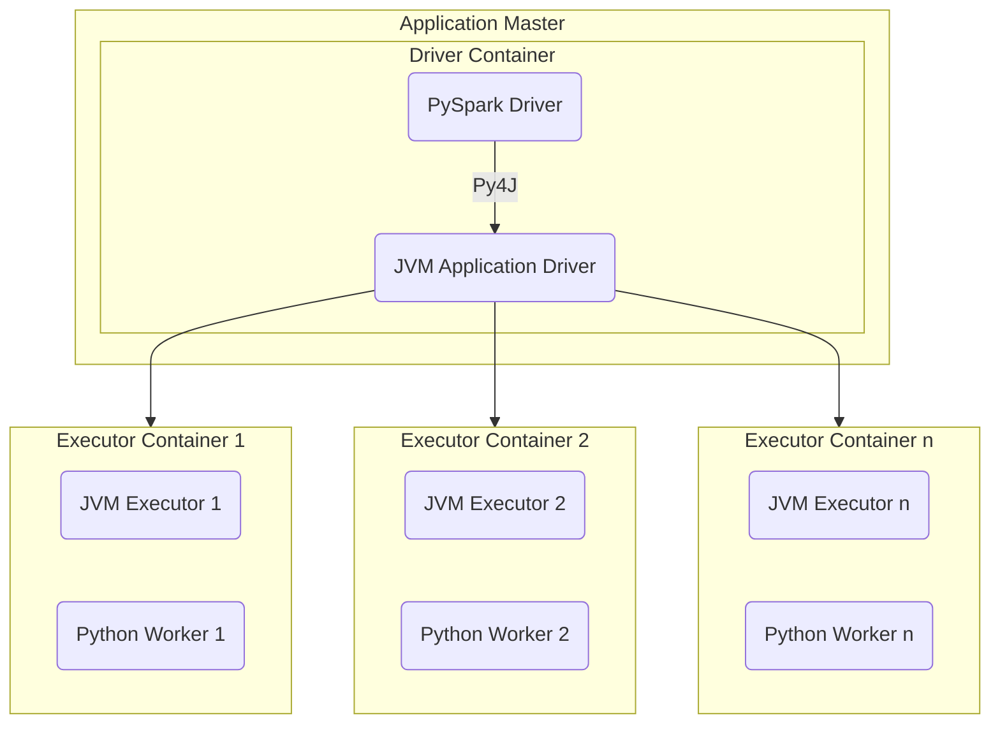

# Spark Fundamentals: Runtime Architecture

## Key Concepts
- Spark is a distributed computing platform for cluster environments.
- Applications are distributed; require a cluster manager (YARN, Kubernetes).
- Resource allocation is container-based (CPU, memory per container).
- `spark-submit` command sends application requests to the YARN Resource Manager for resource allocation.

## Architecture Overview
- Core implementation: Scala (JVM).
- PySpark: Python interface using Py4J to communicate with JVM.
- Main method runs in a container (isolated runtime).
- Driver coordinates; executors process data.

## Components
- **Driver**
  - Runs main() method.
  - PySpark: Python driver + JVM driver (via Py4J).
  - Scala: JVM driver only.
- **Executors**
  - JVM processes for task execution.
  - Launched in containers with fixed resources.
- **Python Workers**
  - Spawned by executors for custom Python code/UDFs.
  - Not needed for standard PySpark DataFrame operations.

## Flow Chart

## Tables
| Component        | Description                                      |
|------------------|--------------------------------------------------|
| Driver           | Orchestrates execution, manages tasks            |
| Executor         | Runs tasks, processes data                       |
| PySpark Driver   | Python process interfacing with JVM via Py4J      |
| JVM Driver       | Main driver on JVM                               |
| Python Worker    | Python runtime for custom code/UDFs              |
| Container        | Isolated environment with allocated resources     |
| Resource Manager | Allocates containers/resources (YARN, Kubernetes)|

## Additional Notes
- Resource limits are enforced per container.
- Pure PySpark operations do not require Python workers on executors.
- Custom Python code/UDFs trigger Python worker creation.
- Driver manages orchestration; executors handle computation.
- Py4J bridges Python and JVM in PySpark.
