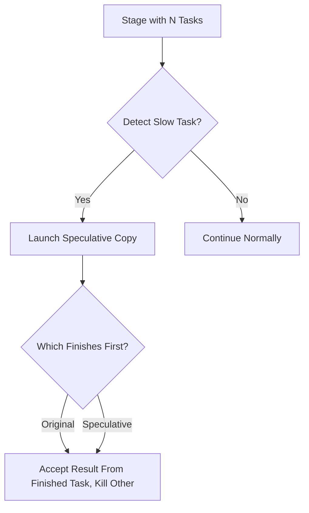

# Spark Fundamentals: Speculative Execution

## Key Concepts
- **Speculative Execution** is a Spark feature to mitigate slow-running tasks in a stage.
- When enabled, Spark detects slow tasks and launches duplicate (speculative) copies on other worker nodes.
- The first copy to finish is accepted; the other is killed.
- Helps when slowness is due to node-specific issues (hardware, overload), not data skew or memory problems.
- Disabled by default due to extra resource consumption and limited effectiveness.

## How Speculative Execution Works
- Spark monitors task durations within a stage.
- If a task is much slower than the median, Spark may launch a speculative copy on another node.
- Only one result is accepted; duplicate work is discarded.

## Configuration Parameters
| Config Key                                 | Default | Description                                                                 |
|--------------------------------------------|---------|-----------------------------------------------------------------------------|
| spark.speculation                          | false   | Enable/disable speculative execution                                        |
| spark.speculation.interval                 | 100ms   | How often Spark checks for slow tasks                                       |
| spark.speculation.multiplier               | 1.5     | Task is speculative if >1.5x median duration of other tasks                 |
| spark.speculation.quantile                 | 0.75    | Fraction of tasks that must finish before speculation is considered         |
| spark.speculation.minTaskRuntime           | 100ms   | Minimum runtime before a task is considered for speculation                 |
| spark.speculation.maxTaskDuration          | (unset) | Hard limit for task duration before speculation                             |

## Example: Enabling Speculative Execution
```python
from pyspark.sql import SparkSession

spark = SparkSession.builder \
    .config("spark.speculation", "true") \
    .config("spark.speculation.multiplier", "1.5") \
    .config("spark.speculation.interval", "100") \
    .getOrCreate()
```

## Mermaid Diagram: Speculative Task Flow


## Limitations
- Does not help with slow tasks due to data skew or insufficient memory.
- Consumes extra cluster resources; may not always improve performance.
- Should be fine-tuned using configuration parameters to avoid unnecessary overhead.

## Additional Notes
- Use speculative execution when cluster has spare resources and node-specific slowness is suspected.
- Always monitor Spark UI and execution plans to assess effectiveness.
- Not a substitute for proper data partitioning or resource tuning.
