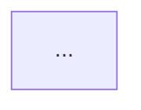

# Prompt for GPT-4.1: Convert Spark Fundamentals Video Transcripts to Technical Notes

## Task
You are given a `.txt` file containing the transcript of a Spark Fundamentals course video. The fundamental topic covered will be indicated in the filename. Your job is to convert this transcript into a detailed, technical markdown (`.md`) file containing concise, to-the-point notes about the specific Spark fundamental covered in the transcript.

## Instructions
- Focus on extracting technical content and key concepts from the transcript.
- Use clear bullet points and sub-bullets for structure.
- Summarize and rephrase content to be concise, to the point, and technical.
- If appropriate, include:
  - Tables for comparisons or structured data
  - Flow charts or architecture diagrams (use Mermaid syntax)
- Highlight important terms and concepts.
- Omit conversational or non-technical content.
- The output should be a well-organized markdown file suitable for technical review or study.
- The markdown file should be titled and structured according to the Spark fundamental indicated in the filename.

## Example Output Structure

```markdown
# Spark Fundamentals: [Topic from Filename]

## Key Concepts
- ...

## Architecture Overview
- ...

## Components
- ...
  - ...

## Flow Chart


## Tables
| Component | Description |
|-----------|-------------|
| ...       | ...         |

## Additional Notes
- ...
```

---

**Feed this prompt and the transcript text file to GPT-4.1 to generate concise, technical notes in markdown format.**
